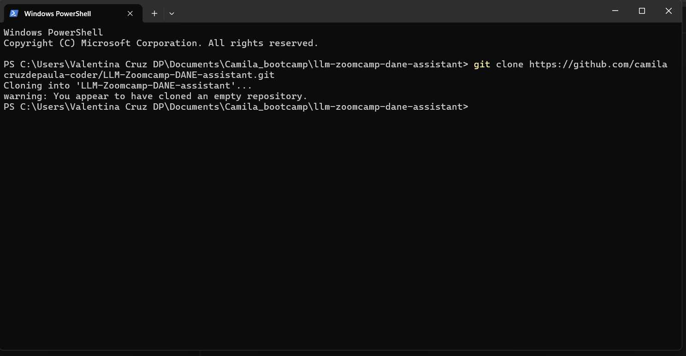
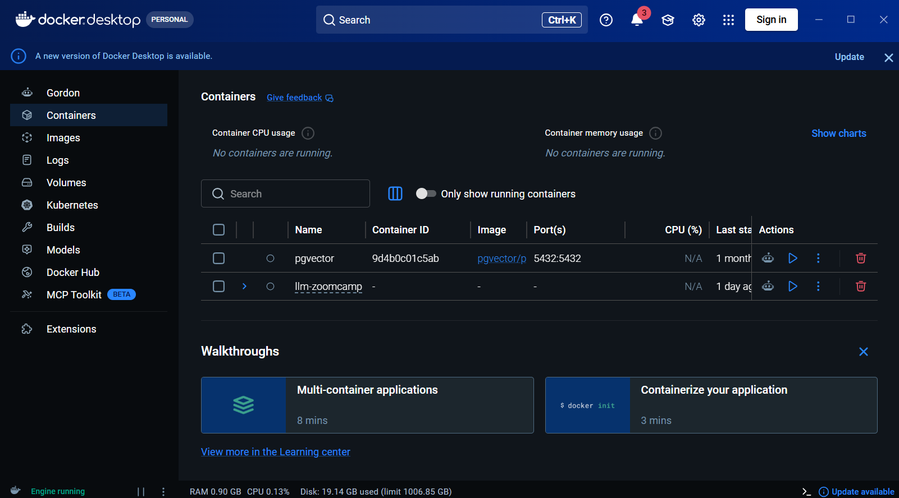
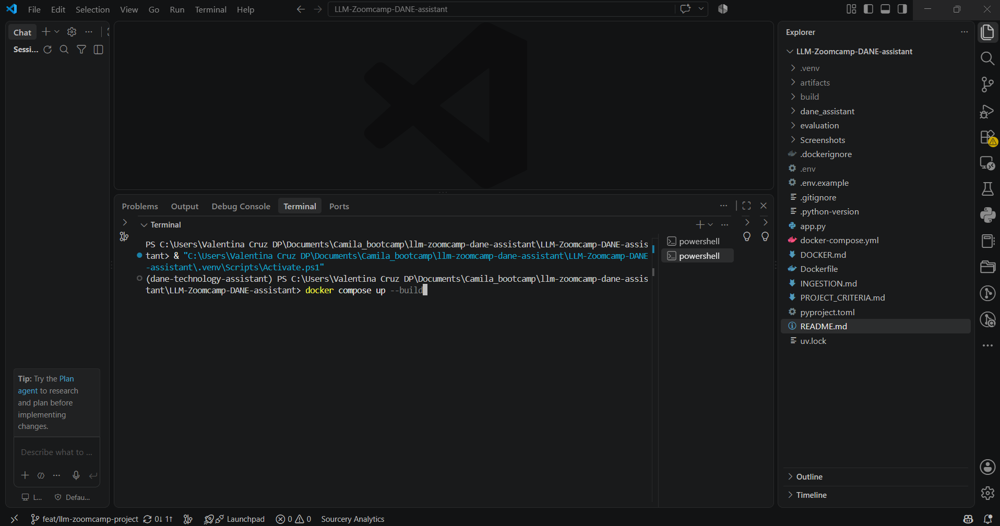
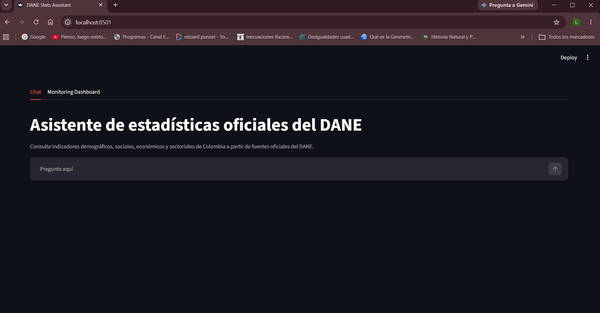
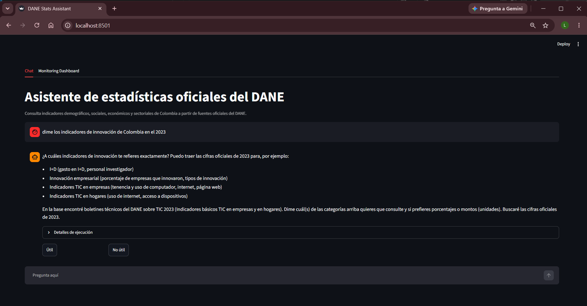
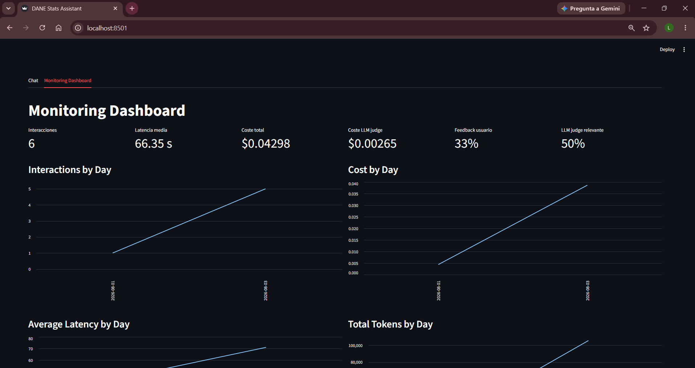
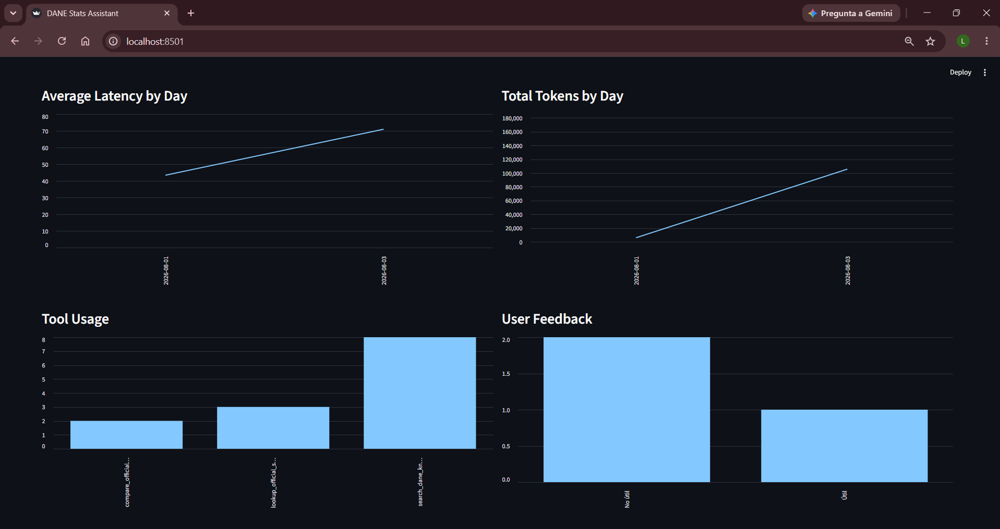
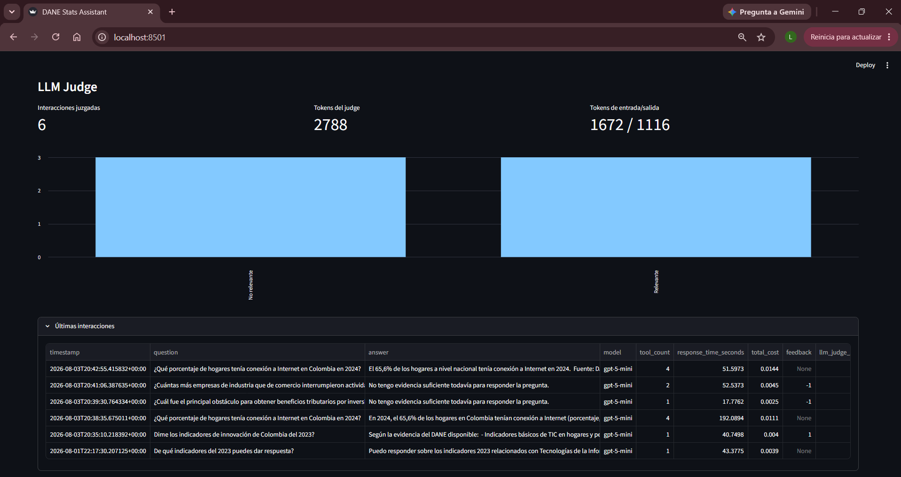

# DANE Technology and Innovation Assistant

An evidence-grounded assistant for consulting official Colombian statistics and
documentation published by the Departamento Administrativo Nacional de
Estadística (DANE) on technology, innovation, research and development (R&D),
and information and communication technologies (ICT).

## Objective

The project makes a selected collection of DANE publications easier to consult
for students, analysts, researchers, and public or private-sector users who need
to locate an official definition, methodology, contextual explanation, or
reported statistical value without manually reviewing multiple reports and
annexes.

The agent chat is intentionally in Spanish. It is designed around the official
DANE website, which publishes Colombia's official statistics for a Spanish-
speaking audience; Spanish is Colombia's official language. The technical
documentation and implementation remain in English for the project submission.

The assistant has two complementary evidence paths:

1. **Documentary questions.** It applies hybrid retrieval over the downloaded
   DANE documents, combining multilingual E5 vector search and BM25 lexical
   search. This path covers definitions, methodological notes, survey scope,
   findings, rankings, and contextual explanations.
2. **Statistical questions.** It queries a local SQLite database built from the
   tabular annexes. This path retrieves a value for a requested category and
   year, or compares two categories that belong to the same official table and
   metric.

The agent routes each question to the appropriate path. It is instructed to use
only retrieved evidence, not to invent figures, and to identify tabular evidence
with its value, unit, year, table, worksheet, and source URL. When the retrieved
evidence is insufficient or ambiguous, it asks for clarification or states that
it cannot answer.

### Scope and limitations

This is **not** a general-purpose assistant for all DANE statistics and it does
not search the public web while answering. Its knowledge base is built from the
specific DANE Technology and Innovation sources listed below and the PDF, Excel,
CSV, and HTML resources linked from those pages at ingestion time. Answers are
therefore constrained by the publications and annexes included in the generated
data artifact.

## Official sources

All source material originates from `dane.gov.co`. The ingestion pipeline starts
from the following official DANE pages and captures their eligible HTML, PDF,
XLS, XLSX, and CSV resources.

| Operation | What the assistant can answer from this source | Official DANE page |
| --- | --- | --- |
| Encuesta de Desarrollo e Innovación Tecnológica (EDIT) | Innovation activities, technological development, R&D, innovation outcomes, financing, obstacles, and characteristics of surveyed enterprises. | [EDIT](https://www.dane.gov.co/index.php/estadisticas-por-tema/tecnologia-e-innovacion/encuesta-de-desarrollo-e-innovacion-tecnologica-edit) |
| Indicadores básicos de TIC en hogares | Household and population access to, ownership of, and use of ICT, including computers, telephones, television, and internet. | [TIC en hogares](https://www.dane.gov.co/index.php/estadisticas-por-tema/tecnologia-e-innovacion/tecnologias-de-la-informacion-y-las-comunicaciones-tic/indicadores-basicos-de-tic-en-hogares) |
| Indicadores básicos de TIC en empresas | ICT access and use in industrial manufacturing enterprises, including computers, connectivity, applications, and electronic commerce. | [TIC en empresas](https://www.dane.gov.co/index.php/estadisticas-por-tema/tecnologia-e-innovacion/tecnologias-de-la-informacion-y-las-comunicaciones-tic/indicadores-basicos-de-tic-en-empresas) |
| Encuesta de Tecnologías de la Información y las Comunicaciones en Hogares (ENTIC Hogares) | Digital access and use in Colombian households and among people aged five and over, including internet, devices, digital services, and selected artificial-intelligence indicators. | [ENTIC Hogares](https://www.dane.gov.co/index.php/estadisticas-por-tema/tecnologia-e-innovacion/tecnologias-de-la-informacion-y-las-comunicaciones-tic/encuesta-de-tecnologias-de-la-informacion-y-las-comunicaciones-en-hogares-entic-hogares) |
| Encuesta de Tecnologías de la Información y las Comunicaciones en Empresas (ENTIC Empresas) | ICT access and use, digital transformation, and selected artificial-intelligence indicators in Colombian economic sectors. | [ENTIC Empresas](https://www.dane.gov.co/index.php/estadisticas-por-tema/tecnologia-e-innovacion/tecnologias-de-la-informacion-y-las-comunicaciones-tic/encuesta-de-tecnologias-de-la-informacion-y-las-comunicaciones-en-empresas-entic-empresas) |

The source pages are living DANE pages. A data artifact represents the resources
available when that artifact was built, so a later ingestion may contain newer
or changed publications.

## How it works

The agent uses `gpt-5-mini` and three dedicated tools. Each tool retrieves a
different type of official evidence and is selected according to the user's
question:

1. **`search_dane_knowledge_base`** answers documentary questions about
   definitions, methodology, context, survey scope, and rankings. It performs
   hybrid retrieval over DANE HTML and PDF documents using E5 dense search and
   BM25 lexical search.
2. **`lookup_official_statistic`** answers requests for a specific official
   value, percentage, count, or indicator. It searches the normalized tabular
   annexes stored in SQLite and can filter by category, year, and unit.
3. **`compare_official_statistics`** answers direct comparisons between exactly
   two categories, sectors, geographies, or periods. It retrieves compatible
   values from the same official table and metric, then returns their explicit
   difference.

```text
Question
  |
  +-- Definition, methodology, context, or ranking
  |     -> Hybrid RAG: E5 dense retrieval + BM25
  |
  +-- Specific official value
  |     -> SQLite + full-text search over normalized tabular annexes
  |
  +-- Direct comparison of two categories
        -> Two compatible SQLite lookups and an explicit difference
```

The Streamlit application also records interaction latency, tokens, estimated
cost, tool usage, user feedback, and a periodic LLM relevance assessment. Its
`Monitoring Dashboard` preserves those records in SQLite.

## User guide

### Run the application with Docker

1. Clone the repository.

   ```bash
   git clone <repository-url>
   ```

   

2. Create `.env` in this folder, next to `docker-compose.yml`, and set
   `OPENAI_API_KEY`, `HF_DATASET_REPOSITORY`.

   

   **Note on `HF_DATASET_REPOSITORY`:** this value is **not** needed to run the
   application — only the `OPENAI_API_KEY` is required to launch it. A Hugging
   Face token is only necessary if you intend to use the *ingestion pipeline*
   to rebuild the knowledge base. In that case you must create a token with
   **Write** permissions:

   1. Go to [huggingface.co](https://huggingface.co) and sign in.
   2. Open **Settings → Access Tokens** (User Access Tokens).
   3. Create a new token and give it the **Write** permission scope.
   4. Save it as `HF_TOKEN` in `.env`, alongside `HF_DATASET_REPOSITORY`.

3. Start the application.

   ```bash
   docker compose up --build
   ```

   Docker downloads and validates the data artifact automatically. The first
   build can take **20 minutes or more**, depending on your connection, because
   Docker downloads the heavy Hugging Face embedding models along with all the
   dependencies.

   
   

4. Open `http://localhost:8501`.

Examples of well-scoped questions:

- `¿Qué porcentaje de hogares tenía conexión a Internet en Colombia en 2024?`
- `¿Qué indicadores de innovación se midieron en Colombia en el 2023?`
- `¿Cuántas más empresas de industria que de comercio interrumpieron actividades de I+D por COVID-19 en 2021?`

### Use the agent

Start a conversation by typing one of the example questions above. The
assistant retrieves official DANE evidence before answering, and it can tell
you whether the answer came from the documentary knowledge base or the tabular
statistics.







The *Monitoring Dashboard* records latency, token and cost usage, tool
activity, user feedback, and the LLM relevance assessment for each
interaction.

### Restart or stop the application

If you need to restart the application without rebuilding the containers, use:

```bash
docker compose up -d
```

This starts the containers in detached mode (in the background). To stop them:

```bash
docker compose stop
```

To start them again without a full rebuild:

```bash
docker compose start
```

### Build the artifact on the source machine

Run this only on the machine that rebuilds the knowledge base:

```bash
uv sync --group ingestion
uv run --group ingestion python -m dane_assistant.ingestion.pipeline --version v1
```

Or run the pipeline in Docker:

```bash
docker compose --profile ingestion run ingestion
```

Verify the generated files before publishing:

```bash
ls -lh artifacts/
```

See [DOCKER.md](DOCKER.md) and [INGESTION.md](INGESTION.md) for publishing and
pipeline details.

## Evaluation

The complete evaluation workflow is in [evaluation/](evaluation/):

- [evaluation.ipynb](evaluation/evaluation.ipynb) runs both the RAG retrieval
  evaluation and the agent evaluation.
- [golden_dataset_rag.jsonl](evaluation/golden_dataset_rag.jsonl) contains the
  document retrieval questions and expected chunks.
- [golden_dataset_agent.jsonl](evaluation/golden_dataset_agent.jsonl) contains
  agent questions, expected values, and expected tool sequences.
- [results/](evaluation/results/) stores generated evaluation outputs.

Open `evaluation/evaluation.ipynb` from the repository root and run its cells to
repeat the evaluation. The notebook evaluates retrieval separately from the
agent's answer, trajectory, and tool-sequence behavior.

## Project evaluation criteria

The mapping between this implementation and every LLM Zoomcamp project criterion
is documented in [PROJECT_CRITERIA.md](PROJECT_CRITERIA.md).
